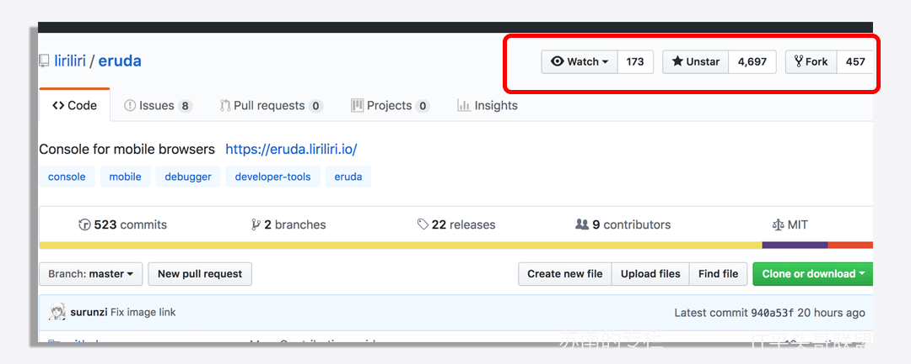
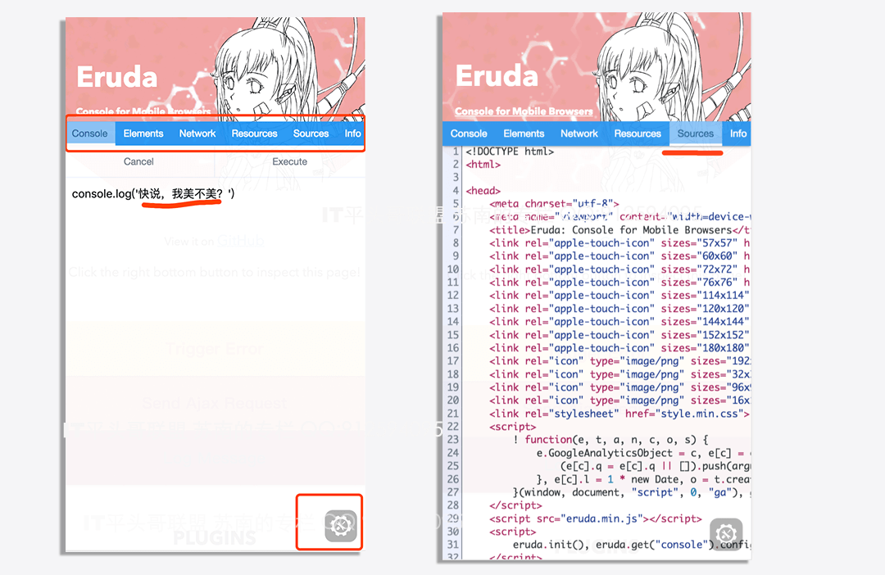
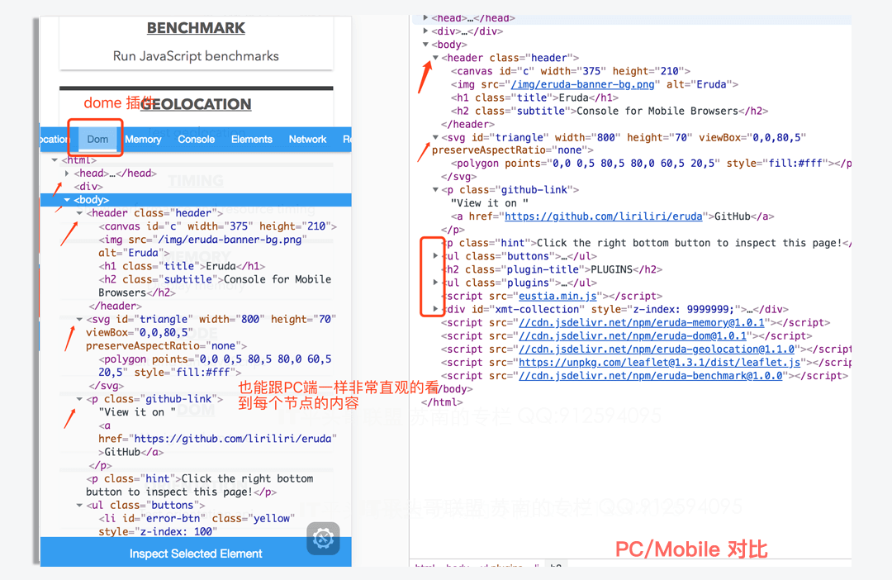
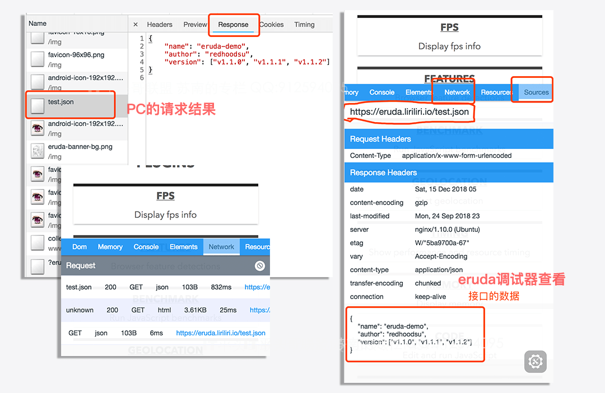

# eruda 一个可能被人遗忘的调试神器


## 引言

​　　日常工作中再牛逼的大佬都不敢说自己的代码是完全没有问题的，既然有问题，那就也就有调试，说到调试工具，大家可能对于`fiddler`、`Charles`、`chrome devtools`、`Firebug`、还有Safari远程调试等比较熟悉，甚至有些是我可能也没有用过的；

　　这里喷一句吧，谁都别给我提IE啊，IE那个不叫调试工具，那叫坑爹神器，话说最近不是又甩锅了，把自己的革命老根据地都甩了。

　　俗话说预先善其事必先利其器，今天想给大家分享的是一个可能被人们忽略的小工具，为什么说被人们忽略呢？因为发现github上它才**4.6k** Star、**457 Fork**、**Watch 173**次，也就是说千万开发者中知道它的人可能不超过5w，于是决定分享一波，此文重在引导，希望能帮大家开发中带来一点点便利、**效率的提升**：



!> 这里是[IT平头哥联盟](https://susouth.com/ "IT平头哥联盟")，我是`首席填坑官`—[苏南](https://github.com/meibin08 "首席填坑官∙苏南"),用心分享 做有温度的攻城狮。


## Eruda是什么？
  
　　**Eruda**是什么？Eruda 是一个专为前端**移动端**、**移动端**设计的调试面板，类似`Chrome DevTools` 的迷你版（没有chrome强大 这个是可以肯定的），其主要功能包括：捕获 `console` 日志、检查元素状态、显示性能指标、捕获XHR请求、显示`本地存储`和 `Cookie `信息、浏览器特性检测等等。

　　虽说日常的移动端开发时，一般都是在用Chrome DevTools浏览器的移动端模式模拟各种手机型号来进行开发和调试，确保功能/页面展示等都没有问题了，才会提交测试；

　　但是前面都讲了，只是**模拟**、**模拟**，当下手机品牌可算是千千万，手机中各种类浏览器，甚至APP都有自己**不一样的特色** 腰间盘突出，有的还特别突出，有病我们得给它治啊，不然测试、产品、需求、领导都不会放过我们，比如下图场景。


## 如何使用？

+ 它支持npm方式的，这个是不是很开心？？
+ 外链，没错，就是外链的形式引入，对于它，我觉得npm的方式没有什么太大意义，直接以外链的引入更方便，也能减少项目资源包的大小，更便于控制是否要加载这个资源。

```js
方式一，默认引入：
<script src="//cdn.jsdelivr.net/npm/eruda"></script>
<script>eruda.init();</script>

方式二，动态加载：

__DEBUG__ && loadJS('http://cdn.jsdelivr.net/eruda/1.0.5/eruda.min.js', ()=>{
  eruda.init();
});//苏南的专栏 交流：912594095、公众号：honeyBadger8

方式三 ，指定场景加载：
//比如线上 给自己留一个后门，
//我们一般的做法是喜欢给某个不起眼的元素，添加一个点击事件，要点它十次、八次以后才开启 debug 模式；
;(function () {
    var src = 'http://cdn.jsdelivr.net/eruda/1.0.5/eruda.min.js';
    if (!/eruda=true/.test(window.location) && localStorage.getItem('active-eruda') != 'true') return;
    document.write('<scr' + 'ipt src="' + src + '"></scr' + 'ipt>');
    document.write('<scr' + 'ipt>eruda.init();</scr' + 'ipt>');
})();

方式四 ，npm：
 npm install eruda --save

…… 加载的方式很多

```


## 小而美

+ 这里小，不是指它的包小啊，知道它的同学都知道，其实它的包并不小（`约100kb gzip`）；
+ 100kb不小了，用形容妹子的话来说就是：**丰满**，直接说它胖，你就死定了；
+ 这里的**小而美**是指小巧功能也强大，界面也好看;
+ 说了这么多 来看看它到底长啥样吧：




## 功能清单 

#### console

+ console 的作用就不用废话了，大家都懂；
+ 早期在`console`诞生之前，我们的调试功能都是alert过多，包括现在的移动端，在手机上我们想看到参数值、数据、节点等都以**alert**打印为多数，但过于粗暴、而且一不小心有可能带到线上去了；
+ **eruda** 能帮我们解决这个问题；所有的日志、错误都能帮我们捕获到
+ 甚至我们还能像`chrome`,直接在控制台执行js代码；


#### Elements

+ **eruda** 它没有在PC端这么直观，但也因为在移动端展示的方式局限性，
+ 它能把每一个父节点下的每一个子节点全部列出来；你点击某个子节点时，列出当前节点全部的属性、样式、盒子模型等；
+ 查看标签内容及属性；查看Dom上的样式；支持页面元素高亮；支持屏幕直接点击选取；查看Dom上绑定的各类事件。
+ 甚至也能使用`Plugins` 插件，做到跟PC端一样，形成 dom tree；




#### Network

+ 现在的项目大多都是前后端分享的形式了，前端处理的业务越来越多、各种请求资源等；
+ 干的越多承担责任也越多、锅也越多，又大又平的那种哦～
+ 所以 **Network** 的必要性不言而喻，它能捕获请求，查看发送数据、返回头、返回内容等信息，它对于我们平时前后端联调出现的问题定位是有很大帮助的，比如：后端说你请求参数少了，前端你看了代码逻辑没有问题，但在手机上就是调不通，Network 能很直接明了的看到你请求带了什么。



#### Resources

+ 它跟 Chrome Devtools 里的 `Application` + **Source**,两者的结合体；
+ Resources 它能查看 Cookie、localStorage、sessionStorage等信息，并且还能执行清除操作（Application）；
+ 它还查看当前页面加载脚本及样式文件；查看页面加载过的图片等资源（Source）；
+ 好吧，感觉说的再多，也不如上图直接：


#### Sources/Info 
+ Sources：查看页面源码；格式化html，css，js代码及json数据。
+ Info：主要输出URL信息及User Agent；及其他的一些手机系统信息，同时也支持自定义输出内容哦。


## 高阶用法

+ 以上刚才介绍的是它的一些基本的功能，也是我自己在工作中用的较多的；
+ 最近发现新版本功能要强大不少，之前一直用的`1.0.5`，好像是没有插件这一项的；
+ 大概看了一下，都蛮强大，包括上面的`Dom tree`,插件这部分并没有都实际应用过，所以也就不`打肿脸充胖子`了，有兴趣的同学可以自己看看。
+ 如果觉得已经的插件都满足不了你的需求，它还支持自定义插件自己编写。


#### 结尾：

　　以上就是今天给大家带来的分享，工作中用了蛮久，挺方便的，对于定位移动端的疑难杂症问题、甚至留下后门定位线上问题都有很大帮助，如文中有理解不到位之处，欢迎留言指出。

　　线上问题我们一般的做法是喜欢给某个不起眼的元素，添加一个点击事件，要点它十次、八次以后才开启 debug 模式；

　　上面二维码确实是真实的官方Dome，不用担心有套路,也有链接：[https://eruda.liriliri.io/](https://eruda.liriliri.io/ )


> 作者：苏南 - [首席填坑官](https://github.com/meibin08/ "IT平头哥联盟-首席填坑官")
>
> 链接：https://blog.csdn.net/weixin_43254766
> 
> 交流群：912594095[`资源获取/交流群`]、公众号：`honeyBadger8`
>
> 本文原创，著作权归作者所有。商业转载请联系`IT平头哥联盟`获得授权，非商业转载请注明原链接及出处。 


