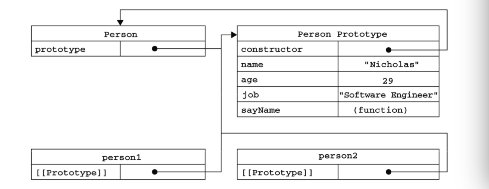

# 在图书馆学习红宝书的一天（二）· 慢慢看原型、原型链就看懂了～


> 作者：[团宠闪光少女∙粉刷酱](https://github.com/cchah/ "团宠闪光少女∙粉刷酱")<br/>
> 来源：[@IT·平头哥联盟](https://honeybadger8.github.io/blog/ "@IT·平头哥联盟")<br/>
> 交流群：[912594095](https://shang.qq.com/wpa/qunwpa?idkey=265166274bca82709718a0ae1fa9c55d65dd3608ebc780f9e6ea41e2761f5ec2 "@IT·平头哥联盟QQ交流群")，本文原创，著作权归作者所有，转载请注明原链接及出处。

## 前言

　　大家好，这里是[@IT·平头哥联盟](https://honeybadger8.github.io/blog/ "@IT·平头哥联盟")，我是`团宠闪光少女`——[粉刷酱](https://github.com/cchah "团宠闪光少女")。
    
   要怎么描述编程是个多幸福的工作呢？
   
   我们很多人都想着如果能一辈子编程，那真是太好了。
   
   而现实生活中，对未来的担忧和焦虑常常困扰着我们。我想，如果要努力维持现有的幸福的话，还是应该不停地学习。于是今天又去图书馆学习了一天，深入了解了js中的原型、原型链，现在跟大家分享一下～


## 正式开讲
   
   原型和原型链大概是毕业时候面试的噩梦了，感觉怎么也理解不了，怎么也不会。后来静下心来想想，其实只是那时候在大学里实践的太少，以至于毕业时候要学习太多的实践知识，html、css、js还有各种框架，而静不下心来细细理解基础理论罢了。那现在，我们一起静下心来，好好理解一下javascript中的面向对象那些事儿吧～

   先了解一下面向对象的意义。
   
   一切事物皆对象，通过面向对象的方式，将现实世界的事物抽象成对象，现实世界中的关系抽象成类、继承，帮助人们实现对现实世界的抽象与数字建模。通过面向对象的方法，更利于用人理解的方式对复杂系统进行分析、设计与编程。同时，面向对象能有效提高编程的效率，通过封装技术，消息机制可以像搭积木的一样快速开发出一个全新的系统。面向对象是指一种程序设计范型，同时也是一种程序开发的方法。对象指的是类的集合。它将对象作为程序的基本单元，将程序和数据封装其中，以提高软件的重用性、灵活性和扩展性。

#### 1.1面向对象

   现在假设我是一个捏泥人的女娲，我每天的kpi是捏二百个泥人～～
```js
var person = {
    name: "Nicholas",
    age: 29,
    job: "Software Engineer",
    sayName: function(){
        alert(this.name);
    } 
};
```
   用对象字面量赋值方式捏了一个，挺简单的嘛，但是还得捏199个，有点累哇，巧了，我不是会编程的嘛，工厂模式走起来，先做一个小工（zuo)厂(fang)
   生产小泥人，那我就只需要把小泥人信息输进去，就可以得到小泥人～～如下：
```js
function createPerson(name, age, job){
    var o = new Object();
    o.name = name;
    o.age = age;
    o.job = job;
    o.sayName = function(){
        alert(this.name);
    };
    return o; 
}
var person1 = createPerson("Nicholas", 29, "Software Engineer");
var person2 = createPerson("Greg", 27, "Doctor");
```
   这样我每天就节省了大量的时间，干点啥好呢，没事做呀～
   继续研究下我这个工厂，虽然解决了创建多个相似对象的问题，但是没有跟上时代面向对象的潮流，实在不高级，用构造函数的方式改写一下。
```js
function Person(name, age, job){
    this.name = name;
    this.age = age;
    this.job = job;
    this.sayName = function(){
        alert(this.name);
    };
}

var person1 = new Person("Nicholas", 29, "Software Engineer");
var person2 = new Person("Greg", 27, "Doctor");
```
   跟工厂函数代码相比，有以下几点区别：

    1、没有显式地创建对象;

    2、直接将属性和方法赋给了 this 对象; 
    
    3、没有return语句。

   但是实际上用构造函数创建实例时，必须使用new操作符。以这种方式调用构造函数实际上会经历以下4个步骤:

    (1) 创建一个新对象;
    
    (2) 将构造函数的作用域赋给新对象(因此 this 就指向了这个新对象);
    
    (3) 执行构造函数中的代码(为这个新对象添加属性);

    (4) 返回新对象。

   构造函数创建的实例person1和person2分别保存着Person的一个不同的实例。这两个对象都有一个constructor(构造函数)属性，该属性指向Person。这就意味着创建的实例可以标识为一种特定的类型。这就有了面向对象的概念了。

   但是这里还是存在一个问题需要优化的问题，每一个实例都创建了一个新的sayName的方法，而创建多个完成同样任务的Function实例是不必要，这里我们可以定义一个全局函数sayName，然后在构造函数中使用this.sayName指向这个全局函数。这样问题是解决了，但是破坏了面向对象的封装的特征。

   所以下面我们需要了解一下js中的原型模式。

#### 1.2 原型模式

   js中，我们创建的每个函数都有一个prototype(原型)属性，这个属性是一个指针，指向一个对象。而这个对象就包含着在实例中共享的属性和方法。这就完美解决了我们上述的这些问题。给个栗子：

```js
function Person(){
}
Person.prototype.name = "Nicholas";
Person.prototype.age = 29;
Person.prototype.job = "Software Engineer";
Person.prototype.sayName = function(){
    alert(this.name);
};
var person1 = new Person();
person1.sayName();   //"Nicholas"
var person2 = new Person();
person2.sayName(); //"Nicholas"
alert(person1.sayName == person2.sayName);  //true
```

   这里Person.prototype指向的就被称为原型对象，默认情况下，所有原型对象都会自动获得一个constructor(构造函数)属性，指向这个prototype所在的函数。也就是Person.prototype.constructor==Person。

   构造函数创建一个新实例后，该实例的内部将包含一个指针(内部属性)，指向构造函数的原型对象。ECMA-262第5版中管这个指针叫[[Prototype]]。虽然在脚本中 没有标准的方式访问[[Prototype]]，但 Firefox、Safari和Chrome在每个对象上都支持一个属性__proto__，指向构造函数的原型对象。

   

   当代码读取某个实例的某个属性时，首先从对象实例本身搜索，如果在实例中找到了该属性，则返回该属性的值;如果没有找到，则继续搜索该实例的原型对象，如果在原型对象中找到了这个属性，则返回该属性的值。

   接下来介绍几个方法：

   isPrototypeOf()方法判断实例与原型之间的关系。

```js
alert(Person.prototype.isPrototypeOf(person1));  //true
alert(Person.prototype.isPrototypeOf(person2));  //true
```

   Object.getPrototypeOf()，在所有支持的实现中，这个方法返回[[Prototype]]的值，即实例对应的原型对象的值。

```js
alert(Object.getPrototypeOf(person1) == Person.prototype); //true
```

   hasOwnProperty()方法属性存在于对象实例中时，才会返回 true。

   in操作符会在通过对象实例能够访问给定属性时返回true，无论该属性存在于实例中还是原型中。

   hasPrototypeProperty()方法实例中具有某属性时为false，实例中不具有原型中具有时为true.

```js
function Person(){
}
Person.prototype.name = "Nicholas";
Person.prototype.age = 29;
Person.prototype.job = "Software Engineer";
Person.prototype.sayName = function(){
    alert(this.name);
};
var person = new Person();
alert("name" in person);  //true
alert(person.hasOwnProperty("name"));  //false
alert(hasPrototypeProperty(person, "name"));  //true
person.name = "Greg";
alert("name" in person);  //true
alert(person.hasOwnProperty("name")); //true
alert(hasPrototypeProperty(person, "name"));  //false
```

   for-in 循环时，返回的是所有能够通过对象访问的、可枚举的(enumerated)属性，其中 既包括存在于实例中的属性，也包括存在于原型中的属性。
   
   Object.keys()方法取得对象上所有可枚举的实例属性.

   Object.getOwnPropertyNames()得到所有实例属性，无论它是否可枚举.

#### 1.3 原型语法和特性

   可以用对象字面量方法来重写整个原型对象。
```js
function Person(){
}
Person.prototype = {
    name : "Nicholas",
    age : 29,
    job: "Software Engineer",
    sayName : function () {
        alert(this.name);
    }
};
```
   但此时constructor属性不再指向Person了，可以重设 constructor 属性。如下：

```js
function Person(){
}
Person.prototype = {
    constructor : Person,
    name : "Nicholas", 7 age : 29,
    job: "Software Engineer",
    sayName : function () {
        alert(this.name);
    }
};
```
   
   这种方式重设 constructor 属性会导致它的[[Enumerable]]特性被设置为true。默认情况下，原生的constructor属性是不可枚举的。所以采用以下方式定义。

```js 
Object.defineProperty(Person.prototype, "constructor", {
    enumerable: false,
    value: Person
});
```

   原型的动态性：由于在原型中查找值的过程是一次搜索，因此我们对原型对象所做的任何修改都能够立即从实例上反映出来——即使是先创建了实例后修改原型也照样如此。

```js 
var friend = new Person();
Person.prototype.sayHi = function(){
    alert("hi");
};
friend.sayHi(); //"hi"(没有问题!)
```
   我们知道，调用构造函数时会为实例添加一个指向最初原型的 [[Prototype]]指针，所以重写原型对象切断了现有原型与任何之前已经存在的对象实例之间的联系;它们引用的仍然是最初的原型。

```js 
function Person(){
}
var friend = new Person();
Person.prototype = {
    constructor: Person,
    name : "Nicholas",
    age : 29,
    job : "Software Engineer",
    sayName : function () {
        alert(this.name);
    }
};
friend.sayName();   //error
```

   我们也可以给原生对象的原型，定义新方法。例如：

```js 
String.prototype.startsWith = function (text) {
    return this.indexOf(text) == 0;
};
var msg = "Hello world!";
alert(msg.startsWith("Hello"));   //true
```
  
   原型中所有属性是被很多实例共享的，包含引用类型值的属性来说就会有些问题。

```js 
function Person(){
}
Person.prototype = {
    constructor: Person,
    name : "Nicholas",
    age : 29,
    job : "Software Engineer",
    friends : ["Shelby", "Court"],
    sayName : function () {
        alert(this.name);
} };
var person1 = new Person();
var person2 = new Person();
person1.friends.push("Van");
alert(person1.friends);    //"Shelby,Court,Van"
alert(person2.friends);    //"Shelby,Court,Van"
alert(person1.friends === person2.friends);  //true
```

#### 1.4 组合使用

   组合使用构造函数模式和原型模式

```js 
function Person(name, age, job){
    this.name = name;
    this.age = age;
    this.job = job;
    this.friends = ["Shelby", "Court"];
}
Person.prototype = {
    constructor : Person,
    sayName : function(){
        alert(this.name);
    }
}
var person1 = new Person("Nicholas", 29, "Software Engineer");
var person2 = new Person("Greg", 27, "Doctor");
person1.friends.push("Van");
alert(person1.friends);    //"Shelby,Count,Van"
alert(person2.friends);    //"Shelby,Count"
alert(person1.friends === person2.friends);//false
alert(person1.sayName === person2.sayName);//true
```
  
   动态原型模式

```js 
function Person(name, age, job){
   //属性
    this.name = name; 
    this.age = age; 
    this.job = job;
   //方法
    if (typeof this.sayName != "function"){
        Person.prototype.sayName = function(){
            alert(this.name);
        }; 
    }
}
var friend = new Person("Nicholas", 29, "Software Engineer");
friend.sayName();
``` 
#### 1.4 原型链

   假如我们让原型对象等于另一个类型的实例，则此原型对象将包含一个指向另一个原型的指针，相应地，另一个原型中也包含着一个指向另一个构造函数的指针。假如另一个原型又是另一个类型的实例，那么上述关系依然成立，如此层层递进，就构成了实例与原型的链条。这就是所谓原型链的基本概念。

```js 
function SuperType(){
    this.property = true;
}
SuperType.prototype.getSuperValue = function(){
    return this.property;
};
function SubType(){
    this.subproperty = false;
}

//继承了 SuperType，原来存在于SuperType的实例中的所有属性和方法，现在也存在于SubType.prototype
SubType.prototype = new SuperType();
var instance = new SubType();
alert(instance.getSuperValue());//true
```

   要注意instance.constructor现在指向的是SuperType，这是因为原来SubType.prototype中的 constructor被重写了的缘故。

   通过实现原型链，本质上扩展了原型搜索机制。当以读取模式访问一个实例属性时，首先会在实例中搜索该属性。如果没有找到该属性，则会继续搜索实例的原型。在通过原型链实现继承的情况下，搜索过程就得以沿着原型链继续向上。就拿上面的例子来说，调用 instance.getSuperValue()会经历三个搜索步骤:1)搜索实例;2)搜索SubType.prototype; 3)搜索 SuperType.prototype，最后一步才会找到该方法。在找不到属性或方法的情况下，搜索过程总是要一环一环地前行到原型链末端才会停下来。

   所有引用类型默认都继承了Object，而这个继承也是通过原型链实现的。大家要记住，所有函数的默认原型都是 Object 的实例，因此默认原型都会包含一个内部指针，指向Object.prototype。这也正是所有自定义类型都会继 toString()、 valueOf()等默认方法的根本原因。

   以上～
   
   一起学习哟～～ 比心～～

   peace&love


> 作者：粉刷酱 - [团宠闪光少女](https://github.com/cchah "团宠闪光少女")
>
> 来源：[@IT·平头哥联盟](https://honeybadger8.github.io/blog/ "@IT·平头哥联盟")
> 
> 链接：https://honeybadger8.github.io/blog/
> 
> 交流群：912594095[`资源获取/交流群`]、386485473(前端) 、260282062(测试)
>
> 本文原创，著作权归作者所有。商业转载请联系`@IT·平头哥联盟`获得授权，非商业转载请注明链接及出处。 
   